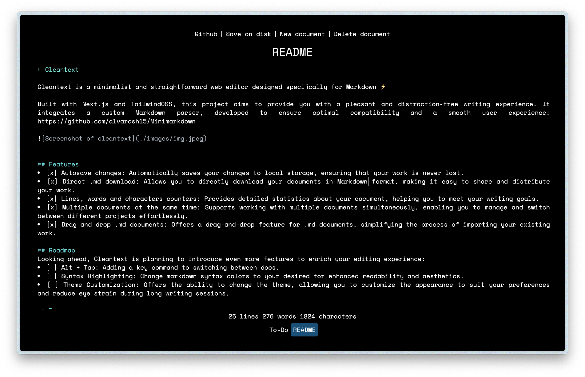

# Cleantext

Cleantext is a minimalist and straightforward web editor designed specifically for Markdown ⚡ 

Built with Next.js and TailwindCSS, this project aims to provide you with a pleasant and distraction-free writing experience. It integrates a custom Markdown parser, developed to ensure optimal compatibility and a smooth user experience: https://github.com/alvarosh15/Minimarkdown

## Features
- [x]  Autosave changes: Automatically saves your changes to local storage, ensuring that your work is never lost.
- [x]  Direct .md download: Allows you to directly download your documents in Markdown format, making it easy to share and distribute your work.
- [x]  Lines, words and characters counters: Provides detailed statistics about your document, helping you to meet your writing goals.
- [x]  Multiple documents at the same time: Supports working with multiple documents simultaneously, enabling you to manage and switch between different projects effortlessly.
- [x]  Drag and drop .md documents: Offers a drag-and-drop feature for .md documents, simplifying the process of importing your existing work.

## Roadmap
Looking ahead, Cleantext is planning to introduce even more features to enrich your editing experience:
- [ ]  Alt + Tab: Adding a key command to switching between docs. 
- [ ]  Syntax Highlighting: Change markdown syntax colors to your desired for enhanced readability and aesthetics.
- [ ]  Theme Customization: Offers the ability to change the theme, allowing you to customize the appearance to suit your preferences and reduce eye strain during long writing sessions.

## Bugs
- You can add a file with the same name as another existing file causing it to be the same "file", acting as if they were the same, and overwriting the existing one.
